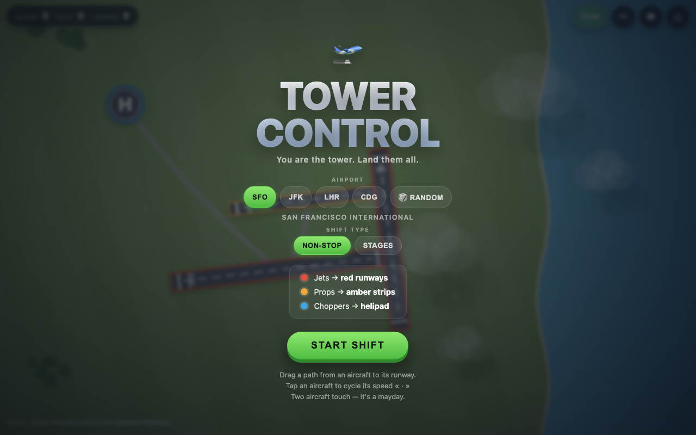
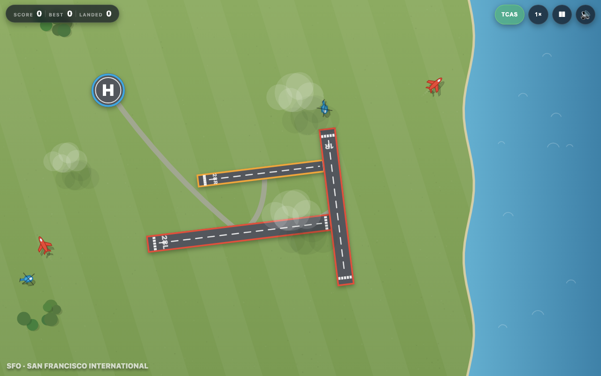
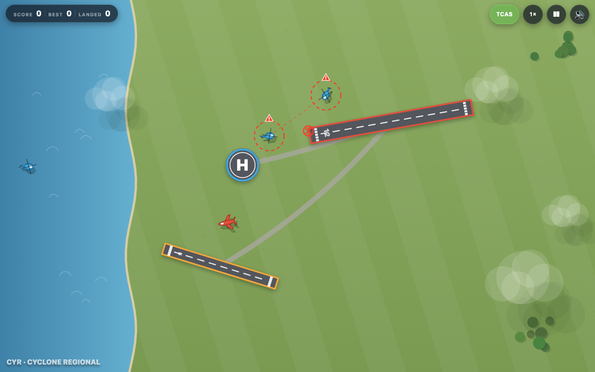
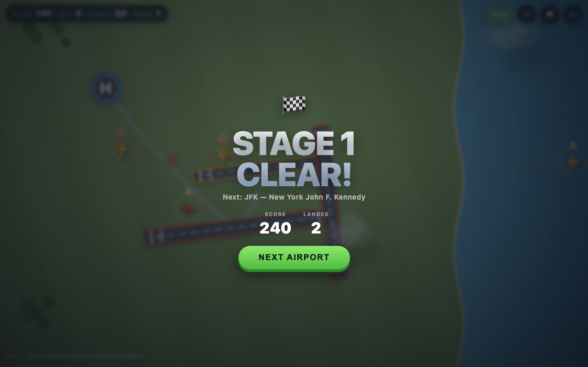

# Tower Control ✈️

A Flight-Control-style air traffic controller game for the browser. You are the tower —
drag flight paths from incoming aircraft to their matching runways and don't let anything touch.

**▶ Play: https://icomppower.github.io/airtrafficcontrollergame/**

| | |
| --- | --- |
|  |  |
|  |  |

## Play

Any static server works (no build step, no dependencies):

```sh
cd airtrafficcontroller
python3 -m http.server 8642
# open http://localhost:8642
```

Works with mouse or touch. Also playable by just opening `index.html` directly.

## How to play

- **Jets (red)** land on red runways · **Props (amber)** on amber strips · **Choppers (blue)** on the helipad
- Drag a path from an aircraft to its runway — it follows your line, then lands automatically
- **Tap an aircraft** to cycle its speed: normal → « slow → fast » (resolve conflicts like a real controller)
- Two aircraft touch → MAYDAY, game over
- Traffic gets denser the longer you survive. Best score is saved locally.

## Airports

Pick your tower on the start screen:

| Code | Airport | Signature |
| --- | --- | --- |
| SFO | San Francisco International | Crossing runway pairs, bay on the east side |
| JFK | New York John F. Kennedy | Staggered parallels 31L/31R + crossing 4L, Jamaica Bay |
| LHR | London Heathrow | Two long parallel runways |
| CDG | Paris Charles de Gaulle | Four runways in two parallel pairs |
| 🎲 | Random generator | New layout, name, and shoreline every time |

## Modes

- **Non-stop** — endless shift, survive as long as you can
- **Stages** — land 50 / 100 / 200 aircraft to clear the stage, then transfer
  to the next airport with a difficulty step-up

## TCAS

Toggle **TCAS** in the HUD (or press `T`): the game extrapolates every aircraft's track,
computes closest point of approach, and flags conflicts before they happen —
amber ⚠ traffic advisories, red resolution advisories with a pulsing ✕ at the
predicted collision point and a link line between the conflicting pair.

Controls: drag to route · tap plane = speed · `Space` pause · `M` mute · `T` TCAS · `F` fast-forward (2×).

## Tech

- Plain HTML5 canvas, zero dependencies, single `game.js`
- All sound is synthesized live with the Web Audio API (`audio.js`) — ambient airfield wind,
  engine drone that scales with traffic, garbled tower radio chatter, TCAS alerts, warning beeps,
  landing chimes, stage fanfare, crash. No audio files.
- Test hooks: `?play` auto-starts, `?ff=30` fast-forwards 30 simulated seconds,
  `&autoland` bot-lands traffic, `&apt=JFK` forces an airport, `&stages=50` forces stage mode,
  `&debug` mirrors game state into the page title.
